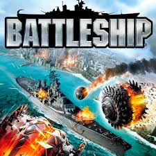

# BattleShip in Python

This Project is a command-line interface game simulating the boardgame of Battleship. I made this project during my 6th year of secondary school as my Leaving cert project.

# Tech Stack

**Client:** Python

# Project info

This project simulates 3 versions of battleship:
1. First is the singleplayer aspect which has the user play against the computer in guessing the computer's ship location in 3 attempts.
2. Second is the two player mode which has 2 local players choose a ship location each and then try to guess eachothers location, exactly like the boardgame
3. Lastly is the simulation mode which allows you to run any number of computer simulated games of battleship and then gives you info regarding to how each game played out.

